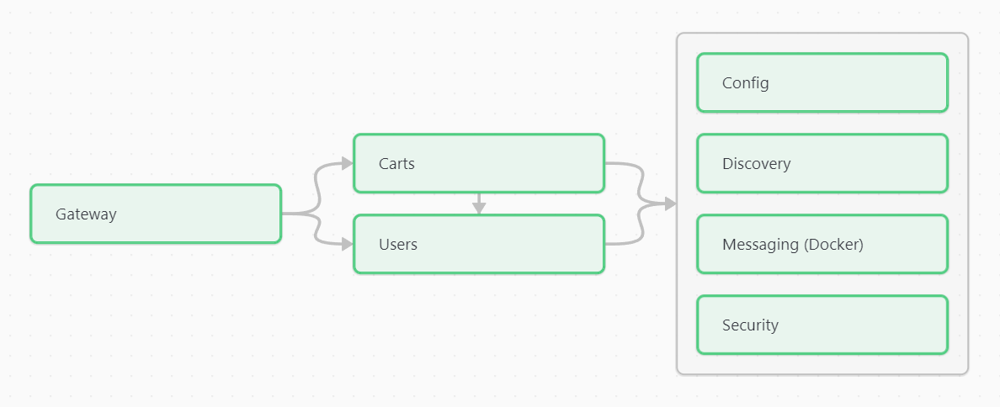

# Shopping carts API

An easy-to-try, well documented Spring-based REST API that manages carts, items, products and users databases, employing a variety of concepts and utilities:

- Design patterns, focusing on Circuit Breaker
- Generics, mappers and exception handling
- Internal HTTP connections via FeignClient
- Unit tests
- Open API / Swagger
- JavaDocs
- Conventional Commits


# Application components


- An API Gateway
  - https://github.com/digitar120/api-gateway
- Shopping cart service
  - The main component, managing carts, items and products
  - https://github.com/digitar120/shopping-cart-app
- User service
  - A secondary service, mainly useful for implementing FeignClient connections. Manages user entries.
  - https://github.com/digitar120/users-app
- Keycloak authentication service
  - https://hub.docker.com/r/digitar120/auth
    - Preconfigured Keycloak image.
- RabbitMQ message broker
- Spring Cloud Config service
  - https://github.com/digitar120/config-server-public.
  - Configured to draw data from https://github.com/digitar120/service-configuration-public
- An Eureka discovery service
  - https://github.com/digitar120/discovery-service

# How to try it out

Right now, the API is separated into:
- `base`: A main branch with a complete spec
- `with-security`: Another with an earlier build but with OAuth2 security.

Each of those have a Windows-compatible version and a Linux-compatible version.

## `base`

For this non-secured branch, you can either call with Postman/cURL, or use the Swagger endpoints:
- http://localhost:8080/swagger/cart
- http://localhost:8080/swagger/user

The main services are at:
- localhost:9000 (carts).
- localhost:9001 (users).

If you prefer to use an HTTP client, some quick endpoints to try are:
- GET /api-docs/cart --- GET /api-docs/user
  - API Docs endpoint for the main microservices
- GET /cart
  - Lists all carts.
- GET /cart/by-userid/{userId}
  - Lists all carts belonging to an user.
  - Calls the Users service.
  - Use `userId` 36693120.
- POST /cart
  - Creates a new cart. It takes JSON data with the following parameters:

```json
{
	"description": "Description",
	"userId": 1
}
```

- GET /cart/{id}/items
  - Lists items contained in a Cart object, with its associated Products.
  - Use `id` 1.

- POST /cart/{cart_id}/product/{product_id}/quantity/{quantity}
  - In a cart, adds a product or updates its assigned quantity.
  - Use `/cart/1/product/1/quantity/15`.


## `with-security`

Right now, the main demonstration is visiting http://localhost:8080/cart, which redirects to the authentication service, and then to the requested endpoint.

You can also test each microservice directly (without calling to the Gateway) with Postman, or [this Gist](https://gist.github.com/digitar120/ca652cd8c925785da6ffc4ee00e074e7), which uses `curl`, `bash` and `jq` [(link)](https://jqlang.github.io/jq/). Use these settings:

- Authorization -> Type: OAuth2
- Access Token URL: http://host.docker.internal:9090/realms/digitar120-shopping-cart-project-realm/protocol/openid-connect/token
- Client ID: spring-cloud-gateway-client
- Client secret: Cl9WL7FhnazS9uDPmdmVarAehvyr44ek


You can find the full list of endpoins in the source code:
- [Shopping Cart](https://github.com/digitar120/shopping-cart-app/tree/dev/src/main/java/com/digitar120/shoppingcartapp/controller)
- [Users](https://github.com/digitar120/users-app/blob/main/src/main/java/com/digitar120/usersapp/controller/UserController.java)

# To-Dos
- Merge secured and non-secured branches.
- Update Spring components.
- Migrate to newer technologies for the Circuit Breaker pattern and the messaging service.
- Integration tests.

***Thanks for reading!***